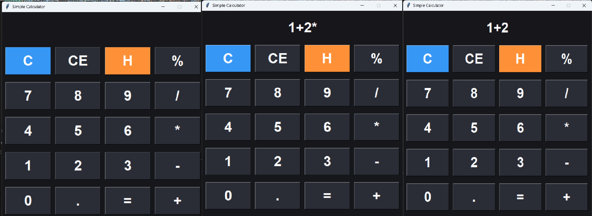
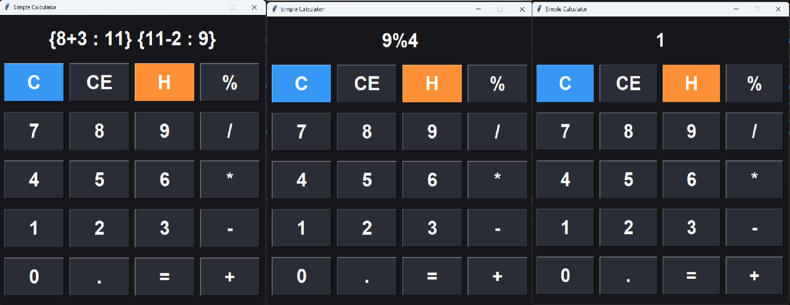

# 🧮 Simple Calculator (Tkinter GUI)

A modern, keyboard-friendly calculator built with Python and Tkinter. Designed with a sleek dark theme and intuitive layout, this app supports basic arithmetic operations, keyboard input, and a history feature.

---

## 🚀 Features

- ✅ Basic operations: `+`, `-`, `*`, `/`, `%`
- 🔢 Number input via buttons or keyboard
- 🧠 Smart expression evaluation with rounding
- 🧹 Clear (`C`) and backspace (`CE`) support
- 📜 History view (`H`) to show recent calculations
- 🎨 Dark-themed UI with bold, readable buttons
- ⌨️ Keyboard shortcuts:
  - Type numbers and operators directly
  - `Enter` to calculate
  - `Backspace` to delete last character
  - `H` to view history

---

## 🖼️ Interface Preview

>   
> 
---

## 🛠️ How to Run

1. Make sure you have Python installed (version 3.x recommended).
2. Clone this repository:
   ```bash
   git clone https://github.com/salamsofi/simple-calculator.git
   cd simple-calculator
   ```
3. Run the script:
   ```bash
   python calculator.py
   ```

---

## 📁 File Structure

```
calculator_using_tkinter.py       # Main application file
README.md                         # Project overview and instructions
calculator_using_tkinter-01.png   # Image of the application 
calculator_using_tkinter-02.png   # Image of the application (Features)
```

---

## 🙌 Credits

Created by [Md](https://github.com/salamsofi)  
Inspired by the simplicity of real-world calculators and the power of Python GUI design.

---